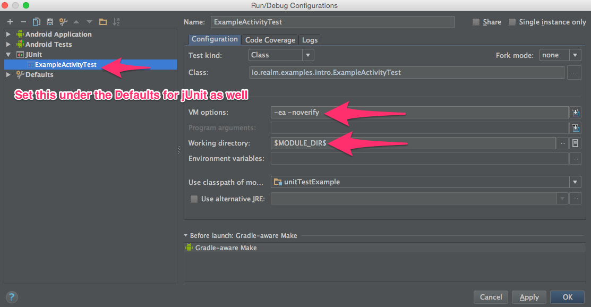

# Running The Tests
Run them in Android Studio or run them via Gradle: 

Instrumentation Tests
`./gradlew connectedCheck`

Unit Tests
`./gradlew test` 

# Troubleshooting

Depending on what version of Java you have installed you may encounter the following errors: 

`initializationError(com.your.ClassHere): Bad <init> method call from inside of a branch`
  
or
 
`Exception in thread "main" java.lang.annotation.AnnotationFormatError: Invalid default: public abstract java.lang.Class org.robolectric.annotation.Config.application()` 

These issues manifest themselves because of changes to the Java bytecode verifier. 
A workaround is to set the `-noverify` flag on the the JVM. 

Typically, the tests can be run via the command line without fail, however, to get them to run in Android Studio you will need to perform the following steps in your run configurations in Android Studio:

[Source 1](http://stackoverflow.com/a/25428318/5210) [Source 2](https://code.google.com/p/powermock/issues/detail?id=504)